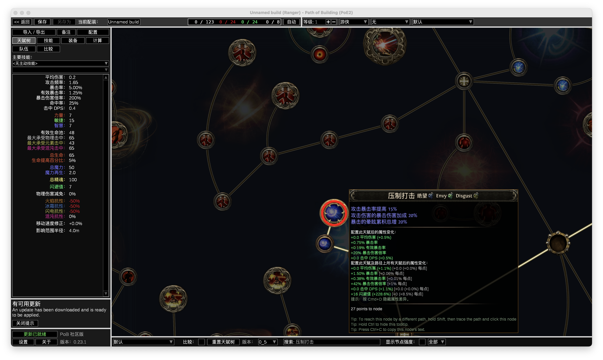
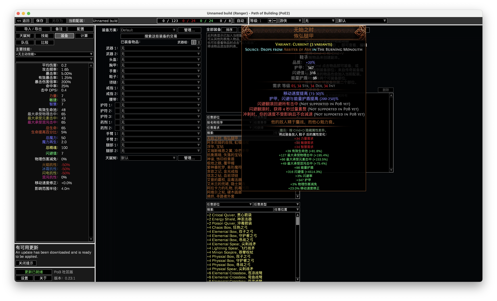

# PoB2 简体中文插件

[下载完整 DMG](https://github.com/snipernan/pob2-zh-cn/releases/latest) · [GitHub 仓库](https://github.com/snipernan/pob2-zh-cn) · [检查状态](https://github.com/snipernan/pob2-zh-cn/actions/workflows/checks.yml)

为 Apple Silicon Mac 原生版 **Path of Building 2** 提供中文显示、检索及输入修复。优先使用已核验的国服术语，缺失内容参照流亡 2 编年史；未核验的文字保留英文。

当前插件 **v0.6.2**，已验证核心 **0.23.1**、天赋树 **0.5**。由社区维护，围绕原生 Mac 版 PoB2 的使用体验持续完善。

## 功能

- 主界面、常用操作和属性差异中文显示。
- 技能名、装备名、装备词缀和天赋树中文显示与对应搜索。
- 修复本次适配的 Mac 原生引擎将中文输入转换成 `??` 的问题。
- F10 切换中英文；Mac 功能键控制系统功能时使用 Fn + F10。
- 保留英文数据、ID、计算逻辑、导出格式及自定义配装和装备标题。

当前验证平台为 Apple Silicon Mac，字库覆盖已收录译文。装备导入沿用 PoB 的英文文本格式；技能长说明、历史版本及动态效果按已核验的映射显示，其余文字保留英文。

## 演示

### 天赋树与属性差异

中文节点名称、效果说明、搜索和属性变化在同一界面展示。



### 装备与词缀

装备列表、传奇名称、词缀、背景文字和装备替换后的属性变化。



## 安装

### 已有 Mac 原生 PoB2

使用 Python 3.9 或更新版本即可安装仓库中已生成的资源。

1. 从本仓库下载源码 ZIP 并解压，或下载维护者提供的 `pob2-zh-cn-plugin-0.6.2.zip`。
2. 先启动原版 PoB2 一次，再保存配装并退出。
3. 在解压目录执行：

```sh
python3 install.py
python3 install.py --status
```

也可双击 `安装或更新汉化.command`。重新打开 PoB2 后生效。

默认目标为 `~/Library/Application Support/PathOfBuildingMacPoE2`。自定义路径：

```sh
python3 install.py --target "/path/to/PathOfBuildingMacPoE2"
```

重复安装复用同一加载入口，自动备份入口并校验资源。核心更新可能覆盖加载入口，此时重新安装并重启。卸载：

```sh
python3 install.py --uninstall
```

状态检查核验磁盘上的入口与资源；运行效果可在重启后的 PoB2 窗口中确认。详见[安装与常见问题](docs/INSTALL.md)。

### 完整安装包

[下载 v0.6.2 完整 DMG（约 389 MiB）](https://github.com/snipernan/pob2-zh-cn/releases/download/v0.6.2/PoB2-0.23.1-zh-CN-0.6.2-AppleSilicon.dmg)，内含核心 0.23.1 和汉化 0.6.2，适用于 M 系列 Mac、macOS 11 及以上。打开后将 App 拖入 Applications 即可使用。

[Release 页面](https://github.com/snipernan/pob2-zh-cn/releases/tag/v0.6.2)附有安装说明和 SHA-256 校验文件。DMG 使用独立数据目录，详见[安装说明](docs/INSTALL.md)。

## 开发

```sh
python3 build_assets.py
python3 scripts/check_repository.py
python3 test_install.py
python3 verify_tree_overlay.py
python3 run_lua.py tests.lua
python3 run_lua.py tests_game_text.lua
```

普通 Lua 测试可用 LuaJIT；Mac 上也可指定 `POB2_MAC_APP` 使用原版 App 的实际 LuaJIT。完整核心集成测试和字库重建见[开发指南](docs/DEVELOPMENT.md)，本轮结果见[验证记录](docs/VALIDATION.md)。GitHub Actions 检查安装器、离线数据重建、资源和 Lua 单元测试；Mac 窗口交互通过原生环境验收。

```text
payload/          运行时 Lua 模块、生成的词典和 Noto 字形图集
translations.tsv  可编辑的界面翻译
data/             审核后的游戏文本映射、来源和最小覆盖输入
fonts/            Noto Sans CJK SC 原始字体和 OFL 许可
packaging/        可配置的 Mac App / DMG 打包器
scripts/          仓库检查、插件 ZIP 和集成测试入口
docs/             安装、开发、数据来源和发布说明
```

## 贡献与许可

提交译文请提供英文原句、国服或编年史来源及对应游戏／PoB 版本。国服已核验译文优先；人工补译须明确标注。详见[贡献指南](CONTRIBUTING.md)和[数据来源](docs/DATA_SOURCES.md)。

本项目原创代码使用 [MIT](LICENSE)。第三方游戏文字、网站内容和字体沿用各自的许可；含非商业许可内容的数据包遵循相应使用条件，具体范围见 [THIRD_PARTY_NOTICES.md](THIRD_PARTY_NOTICES.md)。

感谢 [PoB2](https://github.com/PathOfBuildingCommunity/PathOfBuilding-PoE2)、[Mac 移植](https://github.com/stevschmid/PathOfBuilding-Mac)、[SimpleGraphic Mac](https://github.com/stevschmid/PathOfBuilding-SimpleGraphic)、腾讯国服公开资料、[流亡 2 编年史](https://poe2db.tw/cn/)和 [Noto CJK](https://github.com/notofonts/noto-cjk)。
